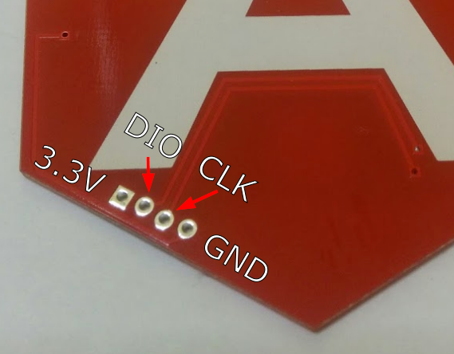
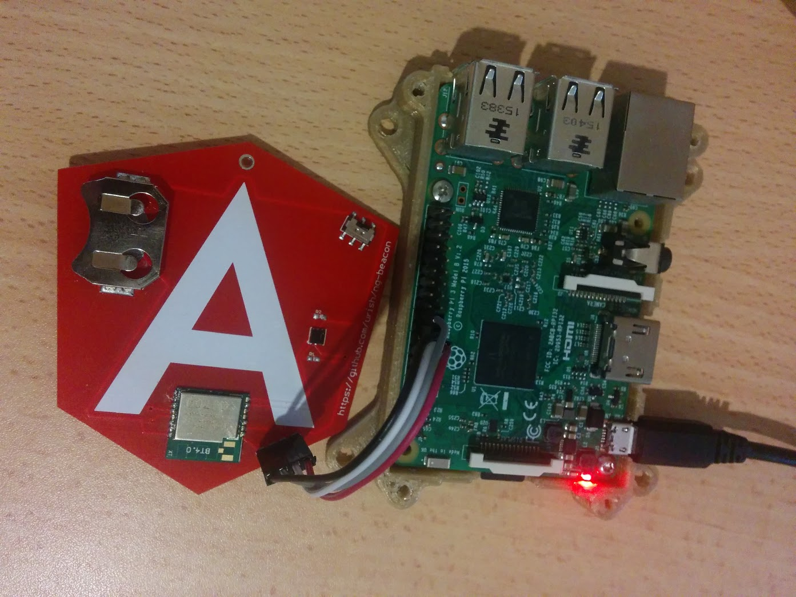

# JavaScript Firmware for ng-beacon

JavaScript firmware for [ng-beacon](https://ngbeacon.io), based on [Espruino](https://espruino.com).

## Firmware Upgrade Instructions
1. Copy all the files to the Raspberry Pi
2. Connect your ng-beacon to the Raspberry Pi (see below)
3. Run `./nrf51-old/flash.sh` 

Programming should take about 20-25 seconds (tested on Raspberry Pi 3). If you connected the ng-beacon correctly, you will see 
the following line in the output:

    Info : nrf51.cpu: hardware has 4 breakpoints, 2 watchpoints

Once the process has finished, you should get an output similar to this:

    wrote 240640 bytes from file espruino_1v91.78_ngbeacon.hex in 21.987272s (10.688 KiB/s)
    ** Programming Finished **
    shutdown command invoked

This means that you have upgraded your firmware successfully!

You can now go to [ngbeacon.io/config](https://ngbeacon.io/config) to connect to the beacon and complete the setup.

## Connecting ng-beacon to the Raspberry Pi

Follow the [guide here](https://learn.adafruit.com/programming-microcontrollers-using-openocd-on-raspberry-pi?view=all#wire-up-the-target-to-swd) for the wiring.

You will have to connect 4 wires: GND, SWDIO (labeled DIO), SWCLK (labeled CLK), 3.3V:

This is what it looks like when wired correctly:

